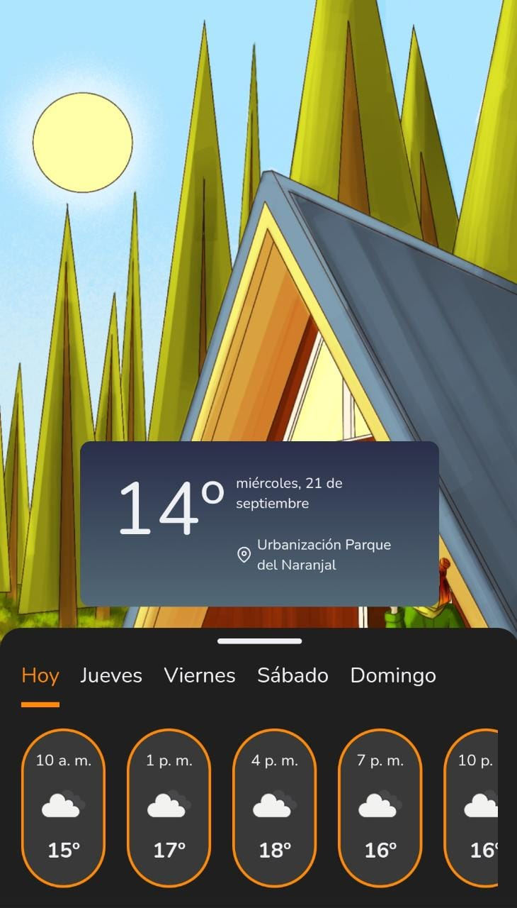

# weatherApp

WeatherApp, es un proyecto implementado desde un diseño en figma, mediante el [curso Esencial de JavaScript y el DOM ](https://leonidasesteban.com/cursos/javascript), cuyo propósito es descubrir el pronóstico del clima y programar tus actividades en relación a ello.

## Desktop

## Mobile

### Links
- [Website Project weatherApp](https://weather-app-teal-six-76.vercel.app/)

## Technologies

- HTML
- CSS
- Responsive Design
- JavaScript
- Promises
- Async
- Geolocation
